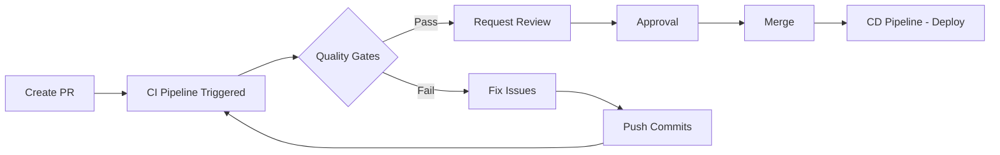

# =á Branch Protection & Quality Gates

This document describes the recommended branch protection rules and quality gates for the Sardag Trading AI repository.

## =Ë Branch Protection Rules

### Main Branch (`main`)

Apply the following branch protection rules to the `main` branch:

####  Require Pull Request Reviews
- **Require approvals**: 1
- **Dismiss stale pull request approvals when new commits are pushed**:  Enabled
- **Require review from code owners**:  Enabled (if CODEOWNERS file exists)

####  Require Status Checks to Pass
- **Require status checks to pass before merging**:  Enabled
- **Require branches to be up to date before merging**:  Enabled

**Required status checks:**
1. `lint` - ESLint and code formatting
2. `typecheck` - TypeScript type checking
3. `build` - Build validation
4. `quality-gate` - Overall CI pipeline quality gate

**Optional status checks** (continue on failure but show status):
- `test` - Unit and integration tests
- `security` - Security audit
- `dependencies` - Dependency analysis

####  Require Conversation Resolution
- **Require conversation resolution before merging**:  Enabled

####  Require Signed Commits
- **Require signed commits**:   Optional (recommended for high-security projects)

####  Include Administrators
- **Include administrators**:  Enabled (admins must also follow rules)

####  Restrict Push
- **Restrict who can push to matching branches**:   Optional (for team projects)
- Allow: Maintainers, Admins

####  Allow Force Pushes
- **Allow force pushes**: L Disabled

####  Allow Deletions
- **Allow deletions**: L Disabled

---

## =¦ Quality Gates

The CI pipeline implements the following quality gates:

### Gate 1: Code Quality (Lint)
- **Tool**: ESLint
- **Criteria**: Zero linting errors
- **Failure Action**: Block merge

### Gate 2: Type Safety (TypeCheck)
- **Tool**: TypeScript compiler
- **Criteria**: Zero type errors
- **Failure Action**: Block merge

### Gate 3: Build Validation
- **Tool**: Next.js build
- **Criteria**: Successful production build
- **Failure Action**: Block merge

### Gate 4: Security Audit
- **Tool**: pnpm audit + TruffleHog
- **Criteria**: No critical/high vulnerabilities
- **Failure Action**: Warning (continue on failure)

### Gate 5: Test Coverage (Optional)
- **Tool**: Vitest/Jest
- **Criteria**: Tests pass
- **Failure Action**: Warning (if tests configured)

---

## =Ý Setup Instructions

### Step 1: Navigate to Branch Protection Settings

1. Go to your GitHub repository
2. Click **Settings** ’ **Branches**
3. Click **Add branch protection rule**

### Step 2: Configure Protection Rule

**Branch name pattern**: `main`

**Protect matching branches** - Enable:
-  Require a pull request before merging
  - Required approvals: **1**
  -  Dismiss stale pull request approvals when new commits are pushed
  -  Require review from Code Owners (if applicable)

-  Require status checks to pass before merging
  -  Require branches to be up to date before merging
  - **Search for status checks:**
    - `lint`
    - `typecheck`
    - `build`
    - `quality-gate`

-  Require conversation resolution before merging

- L Require signed commits (optional)

-  Require linear history

-  Include administrators

- L Allow force pushes

- L Allow deletions

### Step 3: Save Protection Rule

Click **Create** to save the branch protection rule.

---

## = GitHub Secrets Required

For CI/CD workflows to function, configure the following secrets:

### Vercel Deployment Secrets

Navigate to **Settings** ’ **Secrets and variables** ’ **Actions** ’ **New repository secret**

| Secret Name | Description | How to Get |
|-------------|-------------|------------|
| `VERCEL_TOKEN` | Vercel authentication token | Vercel Dashboard ’ Settings ’ Tokens |
| `VERCEL_ORG_ID` | Vercel organization ID | Run `vercel link` locally, check `.vercel/project.json` |
| `VERCEL_PROJECT_ID` | Vercel project ID | Run `vercel link` locally, check `.vercel/project.json` |

### Optional Secrets

| Secret Name | Description |
|-------------|-------------|
| `GROQ_API_KEY` | Groq AI API key (for build if needed) |
| `FIREBASE_SERVICE_ACCOUNT` | Firebase service account JSON (for build if needed) |

---

## =Ê Monitoring Quality Gates

### View CI Pipeline Status

All pull requests will show CI pipeline status:

```
 lint - passed
 typecheck - passed
 test - passed
 build - passed
 security - passed (warning)
 quality-gate - passed
```

### Failed Quality Gate

If any quality gate fails:

1. Click **Details** next to the failed check
2. Review the error logs
3. Fix the issues locally
4. Push new commits to the PR branch
5. CI will automatically re-run

---

## <¯ Quality Gate Thresholds

| Check | Success Criteria | Failure Threshold |
|-------|-----------------|-------------------|
| **Lint** | 0 errors, 0 warnings | Any error |
| **TypeCheck** | 0 type errors | Any type error |
| **Build** | Build succeeds, .next directory created | Build fails |
| **Tests** | All tests pass | Any test failure |
| **Security** | No critical/high vulnerabilities | Critical vuln (warning only) |

---

## = Workflow Integration

### Pull Request Flow



### Main Branch Protection Flow

```
Developer ’ Fork/Branch ’ Commit ’ Push ’ PR ’ CI Checks ’ Review ’ Merge ’ Deploy
                                            “
                                      Must Pass:
                                      - Lint 
                                      - TypeCheck 
                                      - Build 
                                      - Quality Gate 
```

---

## =à Local Development Quality Checks

Before pushing, run these commands locally:

```bash
# 1. Lint code
pnpm lint

# 2. Type check
pnpm exec tsc --noEmit

# 3. Run tests (if configured)
pnpm test

# 4. Build application
pnpm build
```

This ensures your code will pass CI quality gates.

---

## =Ú Additional Resources

- [GitHub Branch Protection Rules](https://docs.github.com/en/repositories/configuring-branches-and-merges-in-your-repository/managing-protected-branches)
- [GitHub Actions Workflows](https://docs.github.com/en/actions/using-workflows)
- [Vercel CLI Documentation](https://vercel.com/docs/cli)

---

**Status:** Ready for Implementation
**Last Updated:** 2025-10-24
