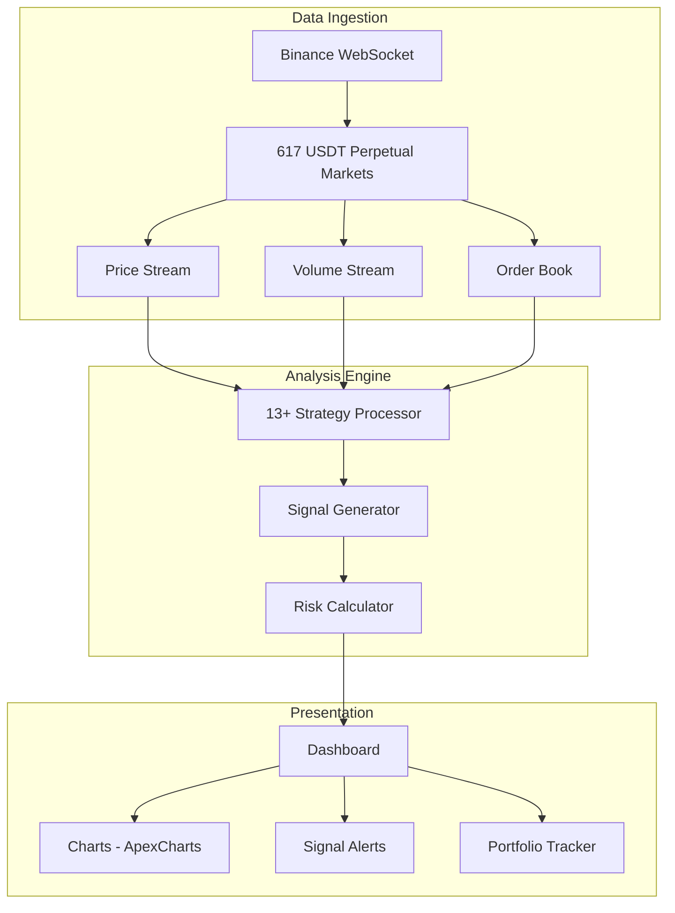

<div align="center">

# LyTrade Scanner - Advanced Crypto Trading Signal Platform

<p><em>Real-Time Monitoring of 617 Binance USDT Perpetual Futures with 13+ Independent Trading Strategies</em></p>

<p>
  <a href="#overview"></a>
  <a href="#platform-architecture"></a>
  <a href="#key-features"></a>
  <a href="#getting-started"></a>
</p>

<p>
  
  
  
  
  
  
  
</p>

<br>

<table>
<tr>
<td width="50%">

**Platform Highlights**
- 617 Binance USDT Perpetual Futures monitored in real-time
- 13+ independent trading strategies running simultaneously
- High-confidence signal surfacing with multi-timeframe analysis
- Top Gainers and Top Volume intelligent filtering system

</td>
<td width="50%">

**Technical Excellence**
- Advanced charting via ApexCharts and Recharts libraries
- Binance WebSocket API for live price, volume, and order book data
- Turborepo monorepo with pnpm workspace management
- PostgreSQL + Redis for persistent signals and real-time caching

</td>
</tr>
</table>

</div>

---

## Overview

LyTrade Scanner is a professional cryptocurrency trading signal platform that monitors 617 Binance USDT Perpetual Futures markets in real-time. It runs 13+ independent trading strategies simultaneously and surfaces high-confidence signals through an advanced dashboard with multiple charting libraries.

## Platform Architecture



## Key Features

- **617 Binance USDT Perpetual Futures** — Real-time monitoring of all major futures markets
- **13+ Trading Strategies** — Conservative Buy, Breakout-Retest, Momentum, Downtrend Reversal, and 9+ additional strategies
- **Deep Market Analysis Engine** — Multi-timeframe technical analysis combining price action and volume
- **Top Gainers / Top Volume Filtering** — Intelligent filtering to surface the most active and promising opportunities
- **Advanced Charting** — Multiple visualization libraries for comprehensive market visualization
- **Real-Time Streaming** — Live price, volume, and change data via Binance WebSocket API

## Trading Strategies

| Strategy | Signal Type | Market Condition |
|---|---|---|
| Conservative Buy | Long | Oversold, strong support |
| Breakout-Retest | Long | Resistance broken and retested |
| Momentum | Long/Short | Strong directional momentum |
| Downtrend Reversal | Long | Exhausted sellers, accumulation |
| Volume Surge | Long/Short | Abnormal volume spike detection |
| RSI Divergence | Long/Short | Price/momentum divergence |
| Moving Average Cross | Long/Short | MA crossover systems |
| Bollinger Squeeze | Long/Short | Volatility contraction breakout |
| MACD Signal | Long/Short | Histogram crossovers |
| Fibonacci Retracement | Long | Golden ratio support levels |
| Order Book Imbalance | Long/Short | Liquidity analysis |
| Funding Rate Extreme | Contrarian | Extreme sentiment reversal |
| Open Interest Spike | Long/Short | Unusual futures positioning |

## Tech Stack

| Layer | Technology | Badge |
|:------|:-----------|:------|
| Frontend | Next.js 15, TypeScript |   |
| Styling | Tailwind CSS |  |
| Charting | ApexCharts, Recharts |  |
| Market Data | Binance WebSocket API |  |
| Database | PostgreSQL, Prisma ORM |  |
| Cache | Redis 7 |  |
| Package Manager | pnpm (Turborepo monorepo) |  |
| Container | Docker |  |

## Project Structure

```
borsa.ailydian.com/
├── apps/
│   └── web/              # Next.js 15 trading dashboard
│       ├── src/
│       │   ├── app/      # App Router pages
│       │   ├── components/
│       │   │   ├── scanner/   # Market scanner components
│       │   │   ├── charts/    # ApexCharts + Recharts wrappers
│       │   │   └── signals/   # Signal display components
│       │   ├── lib/
│       │   │   ├── strategies/ # 13+ strategy implementations
│       │   │   ├── binance/    # Binance API/WebSocket client
│       │   │   └── analysis/  # Technical analysis engine
│       │   └── stores/   # Zustand state management
├── packages/
│   └── shared/           # Shared types and utilities
├── prisma/               # Database schema
└── scripts/              # Data seeding and utilities
```

## Getting Started

### Prerequisites

- Node.js 20+
- pnpm 8+
- PostgreSQL 16
- Redis 7
- Binance API credentials (read-only for market data)

### Installation

```bash
# Clone the repository
git clone https://github.com/lydianai/borsa.ailydian.com.git
cd borsa.ailydian.com

# Install dependencies
pnpm install

# Configure environment variables
cp .env.example .env.local

# Run database migrations
pnpm db:migrate

# Start development server
pnpm dev
```

The trading dashboard will be available at `http://localhost:3000`.

## Environment Variables

| Variable | Description | Required |
|---|---|---|
| `DATABASE_URL` | PostgreSQL connection string | Yes |
| `REDIS_URL` | Redis connection string | Yes |
| `BINANCE_API_KEY` | Binance API key (read-only) | Yes |
| `BINANCE_SECRET_KEY` | Binance API secret | Yes |
| `NEXTAUTH_SECRET` | Authentication secret | Yes |
| `NEXT_PUBLIC_WS_URL` | WebSocket server URL | Yes |

## Market Coverage

The scanner monitors all USDT Perpetual Futures contracts on Binance, including:

- **Top Market Cap** — BTC, ETH, BNB, SOL, and all major cryptocurrencies
- **DeFi Tokens** — All major decentralized finance protocol tokens
- **Layer 2 Tokens** — Scaling solution ecosystem tokens
- **Emerging Markets** — New listings and high-growth opportunities

## Security

See [SECURITY.md](SECURITY.md) for the vulnerability reporting policy.

- All API credentials stored as environment variables (never in source code)
- Binance API key limited to read-only market data permissions
- Rate limiting on all endpoints
- OWASP Top 10 mitigations applied

## Disclaimer

This platform is for informational and educational purposes only. Trading cryptocurrency carries significant financial risk. Never invest more than you can afford to lose. Past performance of trading signals does not guarantee future results.

## License

Copyright (c) 2024-2026 Lydian (AiLydian). All Rights Reserved.

This is proprietary software. See [LICENSE](LICENSE) for full terms.

---

Built by [AiLydian](https://www.ailydian.com)
