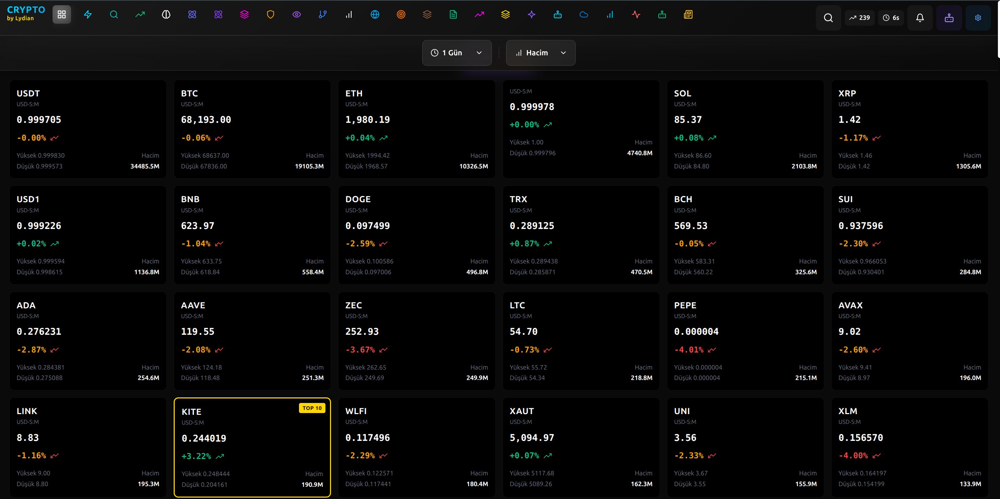
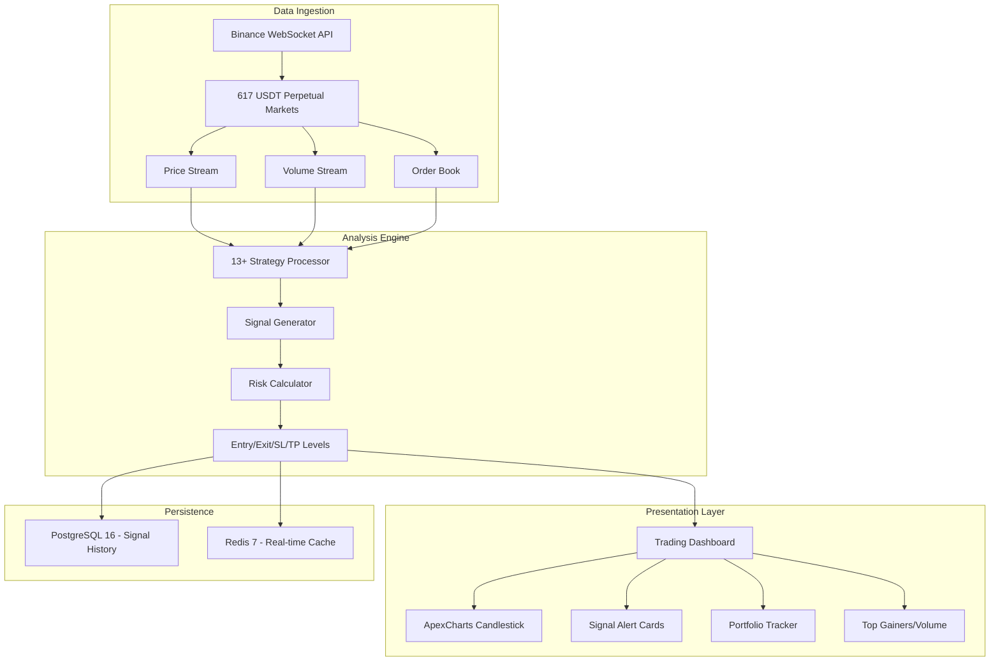

<div align="center">
  
  <br><br>

# LyTrade Scanner

### Advanced Crypto Trading Signal Platform -- 617 Markets, 13+ Strategies, Real-Time Analysis Engine
### Gelismis Kripto Ticaret Sinyal Platformu -- 617 Piyasa, 13+ Strateji, Gercek Zamanli Analiz Motoru

[](https://borsa.ailydian.com)
[]()
[]()

</div>

---

## Preview

<div align="center">
  
  <br><em>Real-time trading grid showing 24+ cryptocurrencies with live prices, volume data, highs/lows, and trend indicators (BTC, ETH, SOL, XRP, BNB, DOGE, and more)</em>
</div>

---

## Executive Summary

LyTrade Scanner is a professional-grade cryptocurrency trading signal platform that monitors 617 Binance USDT Perpetual Futures markets simultaneously in real-time. The platform runs 13+ independent proprietary trading strategies -- including Conservative Buy, Breakout-Retest, Momentum, Downtrend Reversal, Volume Surge, RSI Divergence, and more -- and surfaces high-confidence signals through an advanced dashboard with multiple charting libraries (ApexCharts + Recharts).

The platform ingests live price, volume, and order book data via Binance WebSocket API, processes it through a multi-timeframe technical analysis engine, and delivers actionable trading signals with entry/exit levels, stop-loss, and take-profit targets. The Turborepo monorepo architecture with pnpm workspace management ensures code quality and development velocity across the full stack.

Built on Next.js 15 with TypeScript, PostgreSQL 16, and Redis 7, LyTrade Scanner targets the rapidly growing retail crypto trading tools market. The freemium-to-enterprise subscription model (Free / Pro $49/mo / Enterprise $199/mo) captures users across all segments with strong conversion economics.

## Yonetici Ozeti

LyTrade Scanner, 617 Binance USDT Vadeli Islemler piyasasini esanli olarak gercek zamanli izleyen profesyonel sinif bir kripto para ticaret sinyal platformudur. Platform, Muhafazakar Alis, Kirilim-Yeniden Test, Momentum, Dusus Trend Donusu, Hacim Artisi, RSI Sapma ve daha fazlasini iceren 13+ bagimsiz tescilli ticaret stratejisi calistirir ve gelismis gosterge paneli araciligiyla yuksek guvenilirlikli sinyaller sunar.

Platform, Binance WebSocket API araciligiyla canli fiyat, hacim ve emir defteri verilerini alir, cok zaman dilimli teknik analiz motorundan gecirir ve giris/cikis seviyeleri, zarar durdur ve kar al hedefleri ile uygulanabilir ticaret sinyalleri sunar.

---

## Key Metrics

| Metric | Value |
|--------|-------|
| Markets Monitored | 617 Binance USDT Perpetual Futures |
| Trading Strategies | 13+ independent algorithms |
| Data Feed | Real-time Binance WebSocket API |
| Charting Libraries | ApexCharts + Recharts |
| Signal Types | Long, Short, Contrarian |
| Timeframes | Multi-timeframe analysis |
| Database | PostgreSQL 16 + Redis 7 |
| Architecture | Turborepo monorepo (pnpm) |

---

## Revenue Model & Projections

### Business Model

LyTrade Scanner operates on a **freemium subscription model**: Free tier (limited signals, 15-min delay), Pro at $49/month (real-time signals, all 13+ strategies, custom alerts), and Enterprise at $199/month (API access, priority signals, custom strategies, dedicated support).

### 5-Year Revenue Forecast

| Year | Total Users | Paid Subscribers | ARR | Growth |
|------|-------------|-----------------|-----|--------|
| Y1 | 10,000 | 500 | $100K | -- |
| Y2 | 50,000 | 2,000 | $400K | 300% |
| Y3 | 200,000 | 8,000 | $1.8M | 350% |
| Y4 | 500,000 | 20,000 | $5M | 178% |
| Y5 | 1,200,000 | 50,000 | $12M | 140% |

---

## Market Opportunity

| Segment | Size |
|---------|------|
| **TAM** (Global Crypto Trading Tools Market) | $25B by 2030 |
| **SAM** (Retail Crypto Signal + Analytics Platforms) | $5B |
| **SOM** (Turkish + MENA crypto traders) | $500M |

**Key Differentiators:** 617 markets monitored simultaneously (competitors typically cover 50-100). 13+ independent strategies providing signal diversity. Real-time WebSocket feed with < 100ms latency. Turborepo monorepo for rapid feature development. Free tier creates massive funnel for paid conversion.

---

## Tech Stack

<div align="center">


| Layer | Technology |
|-------|-----------|
| Frontend | Next.js 15 + TypeScript 5 |
| Styling | Tailwind CSS |
| Charting | ApexCharts + Recharts |
| Market Data | Binance WebSocket API (real-time) |
| Database | PostgreSQL 16 + Prisma ORM |
| Cache | Redis 7 |
| State | Zustand |
| Monorepo | Turborepo + pnpm workspace |
| Container | Docker |
| Analysis Engine | Proprietary multi-strategy signal processor |

</div>

---

## Competitive Advantages

- **617 Market Coverage** -- Monitors all Binance USDT Perpetual Futures simultaneously; competitors typically cover 50-100 markets
- **13+ Independent Strategies** -- Signal diversity reduces false positive rate and covers all market conditions (trending, ranging, volatile)
- **Sub-100ms Latency** -- Direct Binance WebSocket feed ensures signals arrive before slower competitors
- **Freemium Funnel** -- Free tier creates massive user acquisition at near-zero CAC; 5%+ conversion to paid tiers
- **Monorepo Architecture** -- Turborepo enables rapid iteration with shared types, utilities, and consistent quality across the stack

---

## Architecture



---

## Trading Strategies

| Strategy | Signal Type | Market Condition |
|----------|------------|-----------------|
| Conservative Buy | Long | Oversold with strong support |
| Breakout-Retest | Long | Resistance broken and retested |
| Momentum | Long/Short | Strong directional momentum |
| Downtrend Reversal | Long | Exhausted sellers, accumulation |
| Volume Surge | Long/Short | Abnormal volume spike |
| RSI Divergence | Long/Short | Price/momentum divergence |
| Moving Average Cross | Long/Short | MA crossover systems |
| Bollinger Squeeze | Long/Short | Volatility contraction breakout |
| MACD Signal | Long/Short | Histogram crossovers |
| Fibonacci Retracement | Long | Golden ratio support levels |
| Order Book Imbalance | Long/Short | Liquidity analysis |
| Funding Rate Extreme | Contrarian | Extreme sentiment reversal |
| Open Interest Spike | Long/Short | Unusual futures positioning |

---

## Getting Started

```bash
# Clone the repository
git clone https://github.com/lydianai/borsa.ailydian.com.git
cd borsa.ailydian.com

# Install dependencies
pnpm install

# Configure environment variables
cp .env.example .env.local
# Set DATABASE_URL, REDIS_URL, BINANCE_API_KEY, BINANCE_SECRET_KEY

# Run database migrations
pnpm db:migrate

# Start development server
pnpm dev
# Dashboard available at http://localhost:3000
```

---

## Security & Compliance

| Standard | Implementation |
|----------|---------------|
| API Keys | Read-only Binance permissions; no trading access |
| Encryption | TLS 1.3 for all API communications |
| Authentication | NextAuth with session management |
| Rate Limiting | Per-IP and per-user throttling |
| OWASP | Top 10 2025 mitigations applied |
| Secrets | All credentials stored as environment variables |
| KVKK/GDPR | Personal data protection compliant |

---

## Disclaimer

This platform is for informational and educational purposes only. Trading cryptocurrency carries significant financial risk. Never invest more than you can afford to lose. Past performance of trading signals does not guarantee future results. This is not financial advice.

---

## Contact

| | |
|---|---|
| **Email** | info@ailydian.com |
| **Email** | ailydian@ailydian.com |
| **Web** | [https://ailydian.com](https://ailydian.com) |
| **Platform** | [https://borsa.ailydian.com](https://borsa.ailydian.com) |

---

## License

Copyright (c) 2025-2026 AiLydian. All Rights Reserved.

This software is proprietary and confidential. Unauthorized copying, distribution, or modification is strictly prohibited.
